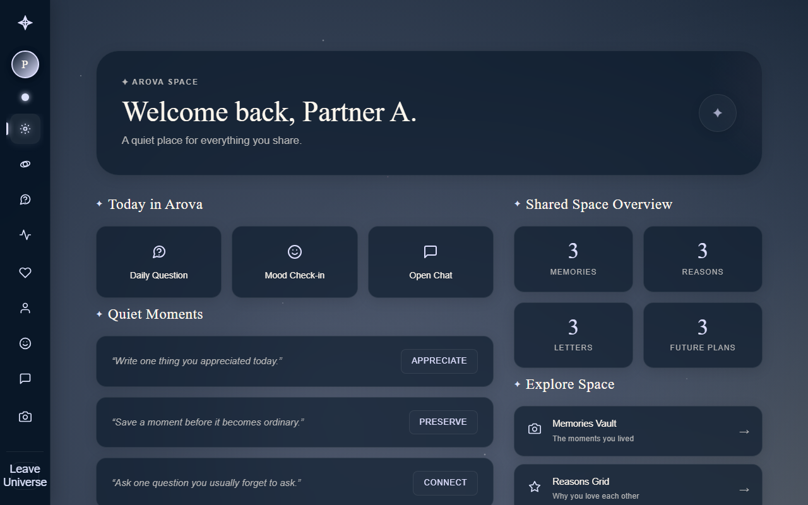
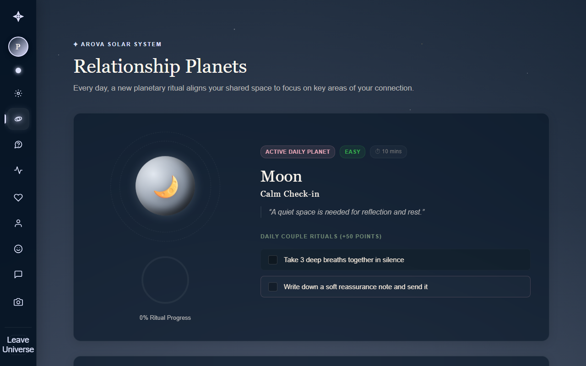
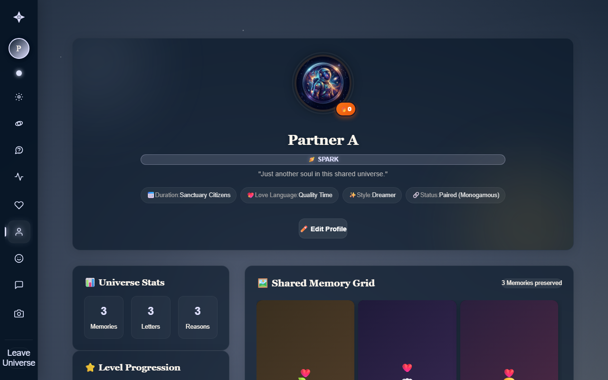
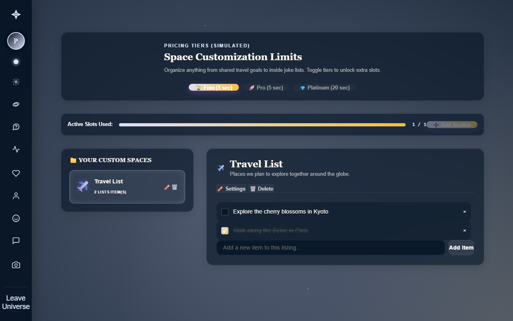
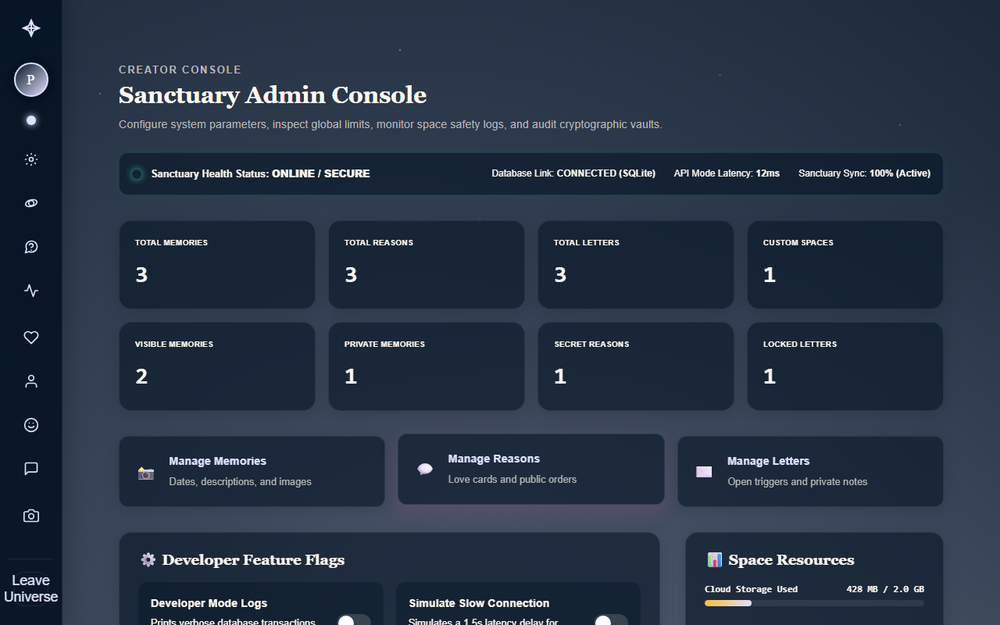
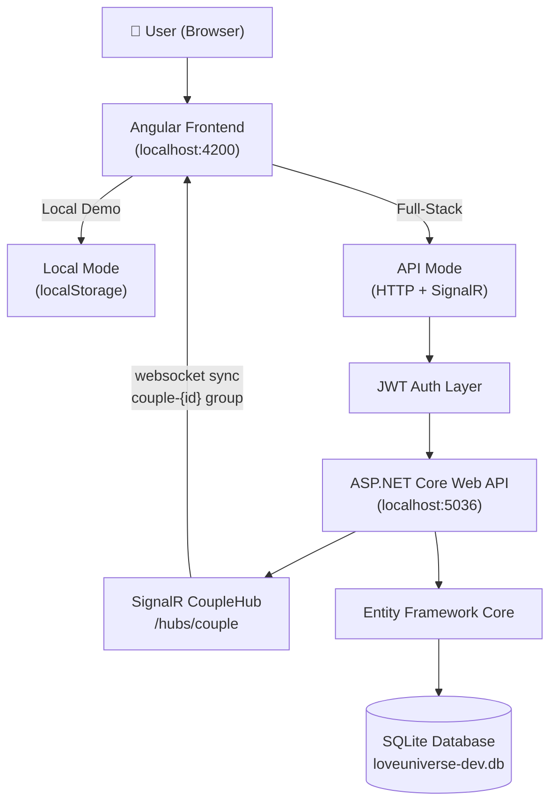

<div align="center">


<br/>

# Arova — A Private Space for Two

### *A full-stack relationship app for couples to save memories, letters, moods, music, goals, and shared rituals in one private universe.*

<br/>

[](https://angular.io)
[](https://www.typescriptlang.org)
[](https://dotnet.microsoft.com)
[](https://docs.microsoft.com/en-us/dotnet/csharp/)
[](https://sqlite.org)
[](https://dotnet.microsoft.com/apps/aspnet/signalr)
[](https://jwt.io)
[](https://playwright.dev)
[](#)
[](LICENSE)

<br/>

[What is Arova?](#-what-is-arova) · [Demo Preview](#-demo-preview) · [Local Mode vs. API Mode](#-local-mode-vs-api-mode) · [Features](#-features) · [Tech Stack](#-tech-stack) · [Architecture](#-architecture) · [Getting Started](#-getting-started) · [Testing](#-testing) · [Deployment](#-deployment) · [Roadmap](#-roadmap) · [Limitations](#-known-limitations) · [Why Arova Matters](#-why-this-project-matters)

</div>

---

## 🔗 Live Demo & Credentials

- **Live Demo:** **<https://arovauni.netlify.app>**
- **Demo Hosting Note:** The live demo is frontend-hosted and supports Local Mode for browser-only exploration.

### 🔑 Local Demo Credentials

To explore Arova instantly in Local Mode without backend setup, use the following local credentials:

- **Owner (Creator):** `owner` / `1234`
- **Partner:** `partner` / `1234`

> *Note: These are demo-only local credentials scoped strictly to the local browser sandbox.*

---

## 📸 Demo Preview

<table>
  <tr>
    <td align="center"><strong>Landing Page</strong><br/></td>
    <td align="center"><strong>Universe Dashboard</strong><br/></td>
  </tr>
  <tr>
    <td align="center"><strong>Plans & Mode Selection</strong><br/>*</td>
    <td align="center"><strong>Profile Setup</strong><br/></td>
  </tr>
  <tr>
    <td align="center"><strong>Custom Space Sections</strong><br/></td>
    <td align="center"><strong>Admin Control Center</strong><br/></td>
  </tr>
</table>

*\*Additional views (Memories, Letters, Mood Room, Music Room, Plans/Checkout comparison, and mobile responsive layout) are fully functional within the application. Automated screenshots can be re-run using `npm run visual:audit`.*

---

## ✦ What is Arova?

Arova is a private, invite-only digital companion designed specifically for exactly two people. It is a shared digital sanctuary—a quiet space for couples to preserve their story, separate from typical busy social platforms.

Inside Arova, two users pair into a couple-scoped space where they can archive memories, lock and seal digital letters with countdown timers, log daily moods, track daily relationship goals, share music, write future plans, complete relationship milestones, and chat in real-time. The interface is built around the **Living Nebula** design system: responsive layouts, glassmorphic panels, and soft ambient backdrops.

From an engineering perspective, Arova demonstrates a robust full-stack architecture. It features a **dual-storage frontend** supporting offline-capable Local Mode (running fully in-browser) and API Mode (connecting to an ASP.NET Core backend with SignalR and Entity Framework Core).

---

## ✦ Local Mode vs. API Mode

Arova implements a dual-mode storage system to simplify testing and deployment:

### 📱 Local Mode
- **Local Mode keeps data in this browser only.**
- Stores all data in `localStorage` under the key `love-universe-data-v1`.
- Fast, zero-config browser demo. No backend required.
- Ideal for quick developer evaluation and static deployments (e.g. Netlify).
- *Limitation:* Does not sync data across devices or support real notifications/reminders.

### 🌐 API Mode
- **API Mode requires the configured backend to be running.**
- Connects account and couple setup to the ASP.NET Core backend (default `http://localhost:5036`).
- Stores data in a database-backed SQLite architecture via EF Core.
- Supports real-time couple chat and presence tracking via SignalR `CoupleHub`.
- Enables true partner account synchronization across multiple devices.
- Requires JWT bearer token authentication (`love-universe-api-token`).
- *Limitation:* Does not work if the backend server is offline.

---

## ✦ Features

| Area | Feature | Description / Parity |
|---|---|---|
| **Public** | Plans & Modes Comparison | Honest Local vs API product comparison + Sandbox Checkout Preview |
| **Auth** | User Session & Signup | JWT token-based auth for API Mode; local session management |
| **Onboarding** | Onboarding Questionnaire | Interactive onboarding questionnaire to seed profile settings |
| **Profile** | User Profiles & Safety | Custom display name, avatars, and age-gated mature content filter |
| **Pairing** | Space Setup & Connect | Pair profiles into a single couple-scoped universe via unique tokens |
| **Universe** | Central Dashboard | Space stats, daily activities, Orbit points, and streaks |
| **Memories** | Memory Vault | Grid list of memories with tags, moods, favorites, and private notes |
| **Letters** | Sealed Letter Vault | Lock digital letters with custom unseal dates and wax seal visual status |
| **Reasons** | Highlighted Reasons | Showcase reasons why you love your partner with reactions |
| **Mood Room** | Interactive Mood Tracker | Log daily moods and view/reply to partner’s state |
| **Music Room** | Shared Sound Track list | Add, review, and delete couple-scoped songs |
| **Future Plans** | Shared Future Board | CRUD board for future goals, travel list, and milestones |
| **Important Dates**| Important Dates & Reminders | Track relationship events, anniversaries, and custom dates |
| **Couple Goals** | Goals Checklist | Share goals and complete milestones (+50 Orbit points per check) |
| **Daily Questions**| Question of the Day | Answer daily prompts and view partner answers once both respond |
| **Gamification** | Points & Rank Badges | Earn Orbit points, build daily streaks, and unlock rank badges |
| **Activity Calendar**| Relationship Heatmap | Streak tracker and calendar mapping daily activities |
| **Chat** | Real-Time Private Chat | SignalR couple-scoped chat, typing indicators, and encryption-ready fields |
| **Admin Panel** | Admin Console | Engagement analytics, logs, feature flags, and slow-network emulator |
| **Backup** | Space Migration Center | JSON data export/import, local schema backups, and space resets |

---

## ✦ Tech Stack

### Frontend
- **Framework:** Angular (v22 Standalone Components & Signals)
- **Language:** TypeScript 6
- **Styling:** SCSS (Living Nebula design system tokens, responsive CSS grid)
- **Realtime:** `@microsoft/signalr` (SignalR websocket connection)
- **Testing:** Playwright E2E testing framework & Vitest unit runner
- **PWA:** Installable Service Worker manifest and PWA install prompt

### Backend
- **Framework:** ASP.NET Core Web API (.NET 10)
- **ORM:** Entity Framework Core
- **Database:** SQLite (development database file `loveuniverse-dev.db`)
- **Authentication:** JWT Bearer authentication scheme
- **Realtime:** SignalR Core hubs (`CoupleHub` broadcast scoped to couple groups)
- **Docs:** OpenAPI / Swagger explorer integration
- **Email:** Console email delivery in development; Resend API provider in production

---

## ✦ Architecture



---

## ✦ Getting Started

### Prerequisites
- Node.js (v20+) and npm (v11+)
- .NET SDK 10.0
- EF Core CLI tool: `dotnet tool install --global dotnet-ef`

---

### 1. Run the Frontend

```powershell
cd frontend
npm install
npm.cmd run build
npm.cmd start
```

*Note: On Windows systems, use the `.cmd` scripts as shown. The client application will launch at **<http://localhost:4200>**.*

---

### 2. Run the Backend

```powershell
cd backend/OurLittleUniverse
dotnet restore
dotnet build

# Apply SQLite database migrations
dotnet ef database update

dotnet run
```

*The backend services will spin up at **<http://localhost:5036>**. View Swagger API docs at **<http://localhost:5036/swagger>**.*

---

## ✦ Testing

Arova utilizes a rigorous test setup covering both frontend E2E and backend integration.

### Frontend E2E (Playwright)

Run Playwright specs against the local Angular server:

```powershell
cd frontend
npm.cmd run build
npm.cmd run test:e2e -- --reporter=list
```

- **Targeted Test Execution:** To test a specific feature spec:
  ```powershell
  npx playwright test e2e/plans.spec.ts e2e/checkout.spec.ts --project=chromium --reporter=list
  ```
- **Playwright Reports:** Generated locally under `frontend/playwright-report/` and `frontend/test-results/`.
- > [!IMPORTANT]
  > **Do not commit generated Playwright videos, screenshots, or HTML reports.** These directories are excluded globally by `.gitignore`.

### Backend Unit & Integration Tests

Run the backend test suite:

```powershell
cd backend
dotnet test
```

---

## ✦ Deployment

### Frontend (Netlify)
Arova's frontend is optimized for static hosting on Netlify. The current configuration is documented in `netlify.toml`:
- **Build Base:** `frontend`
- **Publish Directory:** `dist/dd/browser`
- **SPA Routing:** Redirects all unhandled requests back to `index.html` (200 rewrite).
- **Security Headers:** Implements strict CSP, HSTS, X-Frame-Options, Referrer-Policy, and PWA manifest cache-control settings.

### Backend (Production)
The ASP.NET Core backend can be containerized or hosted on cloud platforms supporting .NET 10 runtimes. 
- *Configuring API Mode:* Make sure to update `frontend/src/environments/environment.production.ts` with your deployed backend's URL.

---

## ✦ Known Limitations

To maintain absolute transparency, the following features are not fully configured or production-active in this portfolio version:

1. **Local Mode keeps data in this browser only.** Local storage does not sync data across devices.
2. **API Mode requires the configured backend.** If the backend server is unreachable, API Mode features will remain disabled.
3. **Real payments are not processed.** Plans checkout relies on Paddle Sandbox. Real billing and Stripe/PayPal payment integrations are planned roadmap items.
4. **Google / Apple OAuth logins** display "provider-not-configured" placeholders.
5. **SMS verification** is simulated in the authentication sandbox.
6. **Push notifications** are not implemented in the current release.
7. **True end-to-end encryption (E2EE)** for chat messages is planned (database holds encryption-ready fields but keys are not managed in this preview).
8. **Email reminders** require configuring SMTP or Resend credentials in `appsettings.json` to deliver digest notifications.
9. **Frontend Netlify demo does not automatically mean backend is deployed.** The live Netlify site runs in Local Mode for browser testing.

---

## ✦ Why This Project Matters

Arova represents a production-ready approach to building private, highly scoped full-stack software:

- **Dual-Mode Architectural Agility:** The client acts as a zero-setup local storage app or a server-connected JWT auth client based on environment configurations.
- **Strict Privacy Isolation:** Couple-scoped resource access logic is deeply embedded into the Entity Framework query pipeline and database schemas—preventing cross-couple data leakage.
- **Visual & Design Craft:** Utilizes bespoke SCSS theme structures, CSS grids, glassmorphism, and responsive styling to maintain a cinematic, premium presentation down to 320px screens.
- **Testing Discipline:** Playwright E2E suites ensure crucial user flows (onboarding, chat sync, plans comparisons) are validated against multiple browser engines.

---

## ✦ Version

```text
v2.1.0 — Checkout Local-vs-API Sprint
```

---

## ✦ License

This is a personal portfolio project. The source code is shared for portfolio demonstration and peer review purposes only.

---

## ✦ Author

Built with care by **Yaman** · [@YJAM20](https://github.com/YJAM20)

*Angular · ASP.NET Core · Playwright · Portfolio 2026*
