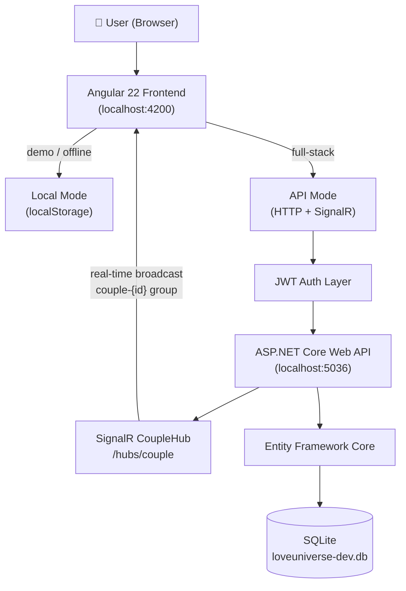

<div align="center">


<br/>

# Arova

### *A private universe for two.*

A full-stack relationship companion web application — a calm, cinematic, shared digital space for two people, built with Angular and ASP.NET Core.

<br/>

[](https://angular.io)
[](https://www.typescriptlang.org)
[](https://dotnet.microsoft.com)
[](https://docs.microsoft.com/en-us/dotnet/csharp/)
[](https://sqlite.org)
[](https://dotnet.microsoft.com/apps/aspnet/signalr)
[](https://jwt.io)
[](https://playwright.dev)
[](#)
[](#license)

<br/>

[What is Arova?](#-what-is-arova) · [Features](#-features) · [Tech Stack](#-tech-stack) · [Architecture](#-architecture) · [Getting Started](#-getting-started) · [Demo Credentials](#-local-demo-credentials) · [Roadmap](#-roadmap) · [Docs](#-documentation)

</div>

---

## 📸 Preview

> Screenshots can be placed under `docs/screenshots/`. A visual audit script is included in the frontend to generate them automatically — see [`frontend/scripts/visual-audit/`](frontend/scripts/visual-audit/README.md).

<table>
  <tr>
    <td align="center"><strong>Landing</strong><br/></td>
    <td align="center"><strong>Auth</strong><br/></td>
  </tr>
  <tr>
    <td align="center"><strong>Universe Dashboard</strong><br/></td>
    <td align="center"><strong>Planets</strong><br/></td>
  </tr>
  <tr>
    <td align="center"><strong>Live Chat</strong><br/></td>
    <td align="center"><strong>Music Room</strong><br/></td>
  </tr>
  <tr>
    <td align="center"><strong>Admin Dashboard</strong><br/></td>
    <td align="center"><strong>Settings</strong><br/></td>
  </tr>
</table>

---

## ✦ What is Arova?

Arova is a private, invite-only digital workspace built for exactly two people. It is not a social network, and it is not a productivity tool. It is a shared sanctuary — a place where a couple can preserve their story together.

Inside Arova, two users pair into a shared couple-scoped space. From there they can archive shared memories, seal and unseal digital letters, log moods, track daily relationship planets with task checklists, share music, write future plans, issue relationship challenges to each other, and send real-time messages — all from within a single, unified interface styled around the **Living Nebula** design direction: deep space backgrounds, glassmorphic cards, and soft ambient typography.

Arova is architected as a serious full-stack portfolio project demonstrating Angular 22 standalone components, ASP.NET Core Web API with Entity Framework Core, JWT authentication, couple-scoped permissions, SignalR real-time communication, Playwright E2E testing, and a dual-mode frontend (Local Mode for zero-backend demos, API Mode for full-stack operation).

---

## ✦ Why It Exists

Most digital tools are built for everyone. Arova is built for two.

The idea is simple: give a couple a private, beautiful, well-engineered space that feels like it belongs to them — not a shared Google Doc, not a chat thread, not a folder. Something with intention, with rooms, with a little ceremony.

From an engineering perspective, Arova exists as a demonstration of how to build a thoughtfully scoped, permission-aware full-stack application — where every piece of data is tied to a couple identity, where the frontend can operate independently or in full API-connected mode, and where the experience is designed to feel premium without pretending to be a production SaaS product.

---

## ✦ Features

| Area | Feature | Notes |
|---|---|---|
| **Public** | Landing page with pricing plans | Free, Pro, Platinum tiers + Gifted Plan flow |
| **Auth** | Register, login, JWT session | Email verification writes to dev console (placeholder) |
| **Onboarding** | Step-by-step questionnaire | Answers stored per user |
| **Profile** | Profile setup, avatar, mature content safety | Age-gated content toggle |
| **Pairing** | Create or join a couple space via token | Couple-scoped from this point forward |
| **Universe** | Central dashboard with stats and Quiet Moments | Personalized greeting, couple statistics |
| **Planets** | 10 relationship planets, calendar-seeded daily | Checklist tasks, +50 pts per completion |
| **Relationship Score** | Points ledger and rank system | Earned through planet tasks and activities |
| **Memories** | Categorized memory grid | Mood emojis, favorites, private notes |
| **Reasons** | Daily highlighted reasons | Reactions: Hearts, Tears, Smiles; random picker |
| **Letters** | Sealed digital letter vault | Locked/unlocked countdowns, wax seal visuals |
| **Mood Room** | Daily mood logging and partner response | Today's mood endpoint |
| **Music Room** | Shared song list | Couple-scoped track management |
| **Challenges** | Couple challenge system | Challenge completion tracking |
| **Future Plans** | Shared future plan board | CRUD for plans |
| **Custom Sections** | User-defined custom spaces | Tier limits: Free 1, Pro 5, Platinum 20 |
| **Chat** | Real-time couple-scoped chat | SignalR, JWT-protected, encryption-ready fields |
| **Admin Dashboard** | Creator console with toggles and logs | Feature flags, slow-network simulation, event logger |
| **Backup** | JSON export/import, database reset | Local data migration tooling |
| **Settings** | 20+ accent themes, couple settings | Theme palette previews |
| **Local Mode** | Full demo without backend | `localStorage`, preset credentials |
| **API Mode** | Full backend connection | JWT + SignalR + EF Core + SQLite |

---

## ✦ Tech Stack

### Frontend

| Technology | Role |
|---|---|
| Angular 22 | Standalone components, signals, routing |
| TypeScript 6 | Type-safe frontend logic |
| SCSS | Custom themes, glassmorphic design tokens, responsive grids |
| `@microsoft/signalr` ^10 | Real-time chat via SignalR client |
| Playwright ^1.60 | E2E testing across Chromium, Firefox, WebKit |
| Vitest | Unit test runner |
| Prettier | Code formatting |
| Visual audit script | Screenshot automation via Node.js |

### Backend

| Technology | Role |
|---|---|
| ASP.NET Core Web API (.NET 10) | REST API layer |
| Entity Framework Core | ORM with migrations |
| SQLite | Development database (`loveuniverse-dev.db`) |
| JWT Bearer Auth | Authentication and token validation |
| SignalR (`CoupleHub`) | Real-time couple-scoped chat |
| Swagger / OpenAPI | API documentation at `/swagger` |
| DTOs | Strongly typed API contracts for every domain |
| Couple-scoped permissions | Every resource is scoped to an active couple |

---

## ✦ Architecture



---

## ✦ Project Structure

```
arova/
├── frontend/                     # Angular 22 SPA
│   ├── src/
│   │   ├── app/
│   │   │   ├── core/             # Guards, interceptors, services, config
│   │   │   ├── features/         # Feature modules (auth, universe, planets, chat…)
│   │   │   ├── layouts/          # Main layout shell
│   │   │   └── shared/           # Shared components and models
│   │   ├── environments/         # environment.ts / environment.development.ts
│   │   └── styles/               # Global SCSS, themes, variables, animations
│   ├── e2e/                      # Playwright E2E specs
│   ├── scripts/visual-audit/     # Screenshot audit automation
│   ├── design/stitch/            # Living Nebula design system reference
│   ├── package.json
│   ├── angular.json
│   └── playwright.config.ts
│
├── backend/
│   └── OurLittleUniverse/        # ASP.NET Core Web API
│       ├── Auth/                 # JWT service, password hasher
│       ├── Controllers/          # REST controllers (20+ domains)
│       ├── DTOs/                 # Request/response contracts
│       ├── Entities/             # EF Core entity models
│       ├── Data/                 # AppDbContext
│       ├── Hubs/                 # SignalR CoupleHub
│       ├── Services/             # Business logic
│       ├── Mapping/              # Entity ↔ DTO mapping
│       ├── Middleware/           # Request middleware
│       └── Common/               # Shared API response wrapper
│
├── docs/                         # Architecture notes, screenshots
│   ├── assets/                   # arova-logo.svg
│   └── screenshots/              # UI screenshots (add here)
│
├── .github/
│   └── workflows/
│       └── arova-ci.yml          # CI workflow
│
├── CHANGELOG.md
├── RELEASE_NOTES.md
├── DOCS_INDEX.md
└── README.md
```

---

## ✦ Getting Started

### Requirements

| Tool | Version |
|---|---|
| Node.js | 20+ |
| npm | 11+ |
| Angular CLI | `npm install -g @angular/cli` |
| .NET SDK | 10.0 |
| dotnet-ef tool | `dotnet tool install --global dotnet-ef` |

---

## ✦ Run the Frontend

```bash
cd frontend
npm install
npm start
```

> On Windows, use `npm.cmd start` if `npm` is not in your PATH directly.

Frontend runs at: **http://localhost:4200**

---

## ✦ Run the Backend

```bash
cd backend/OurLittleUniverse

dotnet restore
dotnet build

# Apply database migrations (creates loveuniverse-dev.db)
dotnet ef database update

dotnet run
```

| URL | Description |
|---|---|
| `http://localhost:5036/swagger` | Swagger API explorer |
| `http://localhost:5036/api/health` | Health check endpoint |

**Authenticating in Swagger:**
Register or log in, copy the returned JWT token, click **Authorize** in Swagger, and enter:
```
Bearer YOUR_TOKEN_HERE
```

---

## ✦ Local Demo Credentials

No backend required. The frontend ships with preset test accounts in Local Mode.

| Role | Username | Password |
|---|---|---|
| Owner (Creator) | `owner` | `1234` |
| Partner | `partner` | `1234` |

> Local Mode stores all data in `localStorage` under the key `love-universe-data-v1`. It is ideal for demos, portfolio reviews, and sandboxed sessions without any backend setup.

---

## ✦ Local Mode vs. API Mode

Arova is designed with a **dual-storage architecture** that separates the demo experience from the full-stack experience.

**Local Mode (default for demos)**
- Data lives in browser `localStorage`
- Session managed via `love-universe-session-v1`
- Full UI accessible with preset credentials
- No backend, no database required

**API Mode (full-stack)**
- Frontend connects to `http://localhost:5036`
- JWT Bearer token authentication (`love-universe-api-token`)
- Entity Framework Core + SQLite persistence
- Real-time chat via SignalR `CoupleHub`

Switch between modes in the frontend configuration or via environment settings.

---

## ✦ Build & Test

### Frontend

```bash
cd frontend

# Production build
npm run build

# Run E2E tests (Playwright)
npm run test:e2e

# Run E2E tests in CI mode (Chromium only)
npm run test:e2e:ci

# Run E2E tests headed (visible browser)
npm run test:e2e:headed

# Visual screenshot audit
npm run visual:audit
```

### Backend

```bash
cd backend/OurLittleUniverse

dotnet restore
dotnet build
```

> On Windows: replace `npm` with `npm.cmd` in all commands above.

---

## ✦ Product Notes

Arova is a **portfolio-grade preview**, not a production SaaS service. The following features are intentionally scaffolded as placeholders:

| Feature | Current State |
|---|---|
| Google / Apple OAuth | Placeholder endpoint (`/api/auth/external-login`) |
| SMS verification | Phone verification is intentionally unavailable in this portfolio environment |
| Email verification | Development mode only — code is written to the console/log |
| Payment / billing | Gifted Plan flow exists; no real payment provider is connected |
| Cloud backups | JSON export/import tooling; no production cloud backend |
| End-to-end encryption | Chat has encryption-ready fields (`EncryptionMode`, `EncryptedPayload`, `Nonce`, `KeyId`) — true E2EE is not yet implemented |

Chat is correctly described as **secure couple-scoped chat with encryption-ready fields.** It is JWT-protected and scoped to the `couple-{id}` SignalR group. True E2EE is a documented roadmap item.

---

## ✦ Roadmap

- [ ] Production OAuth (Google / Apple)
- [ ] Real SMS / email verification
- [ ] Payment integration (Stripe or equivalent)
- [ ] Cloud backup and storage
- [ ] True end-to-end encrypted chat (WebCrypto, client-side key management)
- [ ] Progressive Web App (PWA) / mobile polish
- [ ] Deployment documentation (Docker, cloud hosting)
- [ ] Push notifications
- [ ] More relationship activities and planet types
- [ ] Expanded media support (photo memories, audio notes)

---

## ✦ Documentation

| Document | Description |
|---|---|
| [`DOCS_INDEX.md`](DOCS_INDEX.md) | Full documentation index |
| [`CHANGELOG.md`](CHANGELOG.md) | Version history |
| [`RELEASE_NOTES.md`](RELEASE_NOTES.md) | Current release summary |
| [`frontend/README.md`](frontend/README.md) | Frontend setup, features, design system |
| [`backend/OurLittleUniverse/README_BACKEND.md`](backend/OurLittleUniverse/README_BACKEND.md) | Backend setup and architecture |
| [`backend/OurLittleUniverse/API_ENDPOINTS.md`](backend/OurLittleUniverse/API_ENDPOINTS.md) | Full API endpoint reference |
| [`backend/OurLittleUniverse/CHAT_SECURITY_NOTES.md`](backend/OurLittleUniverse/CHAT_SECURITY_NOTES.md) | Chat security and E2EE roadmap |
| [`backend/OurLittleUniverse/FRONTEND_BACKEND_ALIGNMENT.md`](backend/OurLittleUniverse/FRONTEND_BACKEND_ALIGNMENT.md) | Frontend ↔ backend contract notes |
| [`frontend/scripts/visual-audit/README.md`](frontend/scripts/visual-audit/README.md) | Visual screenshot audit guide |

---

## ✦ Security & Privacy

- All authenticated endpoints require a valid JWT Bearer token.
- Every resource (memories, letters, chat, moods, plans, etc.) is scoped to the user's active couple identity — no data leaks across couples.
- Passwords are stored as hashed values via a dedicated `IPasswordHasherService`.
- Chat messages are broadcast only to the `couple-{id}` SignalR group.
- No real secrets, private screenshots, or production credentials are committed to this repository. See [`BACKEND_PRIVACY_SECRET_SCAN_REPORT.md`](backend/OurLittleUniverse/BACKEND_PRIVACY_SECRET_SCAN_REPORT.md).
- SQLite database files (`*.db`, `*.sqlite`) and `.env` files are excluded via `.gitignore`.

---

## ✦ Contributing

Arova is a personal portfolio project and is not currently accepting external contributions. If you have feedback, questions, or are a recruiter or collaborator interested in connecting, please reach out via GitHub.

---

## ✦ Version

```
v1.0.0 — Arova Portfolio Preview
```

---

## ✦ License

This project is prepared as a personal portfolio project. All rights reserved by the author. It is shared publicly for portfolio and demonstration purposes only.

---

## ✦ Author

<div align="center">

Built with care by **Yaman** · [@YJAM20](https://github.com/YJAM20)

*Angular · ASP.NET Core · Full-Stack · Portfolio 2025*

<br/>

[](https://github.com/YJAM20)

</div>
