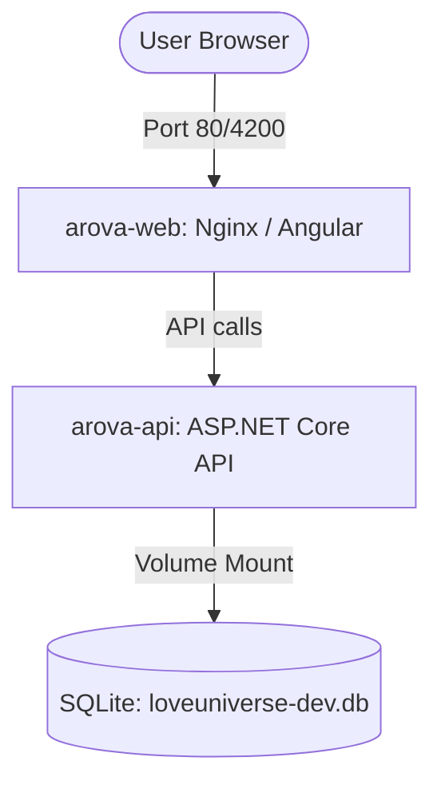

# Design Spec: Full-Stack Docker Containerization

**Date**: 2026-07-12  
**Author**: Antigravity  
**Status**: Approved (User approved the conceptual design and delegated full implementation details)

---

## 1. Goal Description

This design details the containerization of Arova using Docker. We will introduce Dockerfiles for both frontend and backend projects, a custom Nginx routing profile for the Angular SPA, and a `docker-compose.yml` file to spin up both projects in a single step.

---

## 2. Docker Architecture

We will run two isolated containers communicating over a local docker network:



---

## 3. Proposed Changes

### Root Folder

#### [NEW] [docker-compose.yml](file:///c:/Dev/Arova/docker-compose.yml)
Wires the frontend, backend, and volume persistence together:
```yaml
version: '3.8'

services:
  arova-api:
    image: arova-api:latest
    build:
      context: ./backend
      dockerfile: OurLittleUniverse/Dockerfile
    ports:
      - "5036:8080"
    environment:
      - ASPNETCORE_ENVIRONMENT=Production
      - Database__Provider=SQLite
      - ConnectionStrings__SqliteConnection=Data Source=/app/data/loveuniverse-dev.db
    volumes:
      - api-data:/app/data

  arova-web:
    image: arova-web:latest
    build:
      context: ./frontend
      dockerfile: Dockerfile
    ports:
      - "80:80"
    depends_on:
      - arova-api

volumes:
  api-data:
```

---

### Backend: OurLittleUniverse

#### [NEW] [Dockerfile](file:///c:/Dev/Arova/backend/OurLittleUniverse/Dockerfile)
Multi-stage build for ASP.NET Core API:
```dockerfile
# Build Stage
FROM mcr.microsoft.com/dotnet/sdk:10.0 AS build
WORKDIR /src

# Copy solution/projects and restore dependencies
COPY ["OurLittleUniverse/OurLittleUniverse.csproj", "OurLittleUniverse/"]
RUN dotnet restore "OurLittleUniverse/OurLittleUniverse.csproj"

COPY . .
WORKDIR "/src/OurLittleUniverse"
RUN dotnet publish "OurLittleUniverse.csproj" -c Release -o /app/publish /p:UseAppHost=false

# Runtime Stage
FROM mcr.microsoft.com/dotnet/aspnet:10.0 AS final
WORKDIR /app
EXPOSE 8080
COPY --from=build /app/publish .
ENTRYPOINT ["dotnet", "OurLittleUniverse.dll"]
```

---

### Frontend: Angular Client

#### [NEW] [Dockerfile](file:///c:/Dev/Arova/frontend/Dockerfile)
Multi-stage build for Angular SPA:
```dockerfile
# Build Stage
FROM node:22-alpine AS build
WORKDIR /app
COPY package*.json ./
RUN npm install
COPY . .
RUN npm run build -- --configuration=production

# Nginx Stage
FROM nginx:alpine
COPY --from=build /app/dist/arova/browser /usr/share/nginx/html
COPY nginx.conf /etc/nginx/conf.d/default.conf
EXPOSE 80
CMD ["nginx", "-g", "daemon off;"]
```

#### [NEW] [nginx.conf](file:///c:/Dev/Arova/frontend/nginx.conf)
Provides routing rules for Nginx to serve the Angular SPA and handle refresh redirects:
```nginx
server {
    listen 80;
    server_name localhost;

    location / {
        root /usr/share/nginx/html;
        index index.html index.htm;
        try_files $uri $uri/ /index.html;
    }

    error_page 500 502 503 504 /50x.html;
    location = /50x.html {
        root /usr/share/nginx/html;
    }
}
```

---

## 4. Verification Plan

### Automated Verification
- Run `docker compose build` to verify both backend and frontend images compile without errors.
- Run `docker compose up -d` to verify both services startup successfully.

### Manual Verification
- Access `http://localhost` in the browser and verify the application runs, reads the database configuration from the container volume, and functions properly in API Mode.
