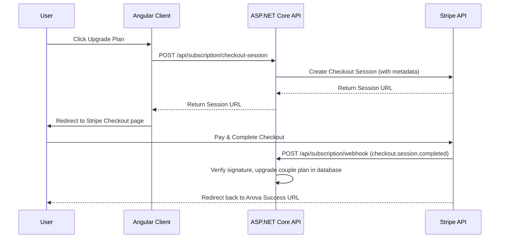

# Design Spec: Stripe Billing & Subscription Webhooks

**Date**: 2026-07-12  
**Author**: Antigravity  
**Status**: Approved (User approved the conceptual design and delegated full implementation details)

---

## 1. Goal Description

This design details the implementation of a production-ready billing flow using the official Stripe SDK. We will create a Stripe Checkout Session endpoint, a secure Webhook controller, and dynamic configuration binding to verify checkout sessions.

---

## 2. Configuration Design

In `appsettings.json`, we will add the configuration settings under the `"Stripe"` section:

```json
{
  "Stripe": {
    "ProPriceId": "price_pro_placeholder",
    "PlatinumPriceId": "price_plat_placeholder"
  }
}
```

> [!IMPORTANT]
> Sensitive credentials such as `ApiKey` and `WebhookSecret` must never be committed to source control in `appsettings.json`. Instead, they should be configured as external secrets using one of the following methods:
> - **User Secrets (Development)**: Run `dotnet user-secrets set "Stripe:ApiKey" "<your_api_key>"` and `dotnet user-secrets set "Stripe:WebhookSecret" "<your_webhook_secret>"` in the backend directory.
> - **Environment Variables**: Configure variables named `Stripe__ApiKey` and `Stripe__WebhookSecret`.
> - **Secret Manager**: Retrieve them dynamically from a secret manager (such as Azure Key Vault or AWS Secrets Manager) in cloud environments.

---

## 3. Webhook Architecture

When a couple selects a subscription upgrade:
1. The frontend calls `/api/subscription/checkout-session` with the requested plan type.
2. The backend creates a Stripe Checkout Session containing metadata: `{ "coupleId": "...", "planType": "Pro" }`.
3. The frontend redirects the user to the Stripe Checkout page.
4. Upon successful payment, Stripe fires a `checkout.session.completed` event to Arova's webhook `/api/subscription/webhook`.
5. The backend verifies the event signature using the `WebhookSecret`, extracts the metadata, and updates the database record status to `Active`.

### Webhook Event Handling Matrix

Arova's webhook controller verifies signatures using the `WebhookSecret` for all incoming events. Upon verification, the following events trigger database synchronization and business logic:

- **`checkout.session.completed`**: Triggers upon new successful subscriptions. The backend extracts metadata (`coupleId`, `planType`), synchronizes the couple's subscription status in the database to `Active`, and assigns the plan type.
- **`customer.subscription.deleted`**: Triggers upon cancellations or end-of-cycle subscription teardown. The backend looks up the couple based on the metadata or Stripe subscription ID, updates the database status, and downgrades the couple's subscription to `Free`.
- **`invoice.payment_failed`**: Triggers upon failed renewal payments. The backend synchronizes the status of the database record as `PastDue`, and sends a system notification to the couple requesting billing information updates.




---

## 4. Proposed Changes

### Backend: OurLittleUniverse

#### [MODIFY] [OurLittleUniverse.csproj](file:///c:/Dev/Arova/backend/OurLittleUniverse/OurLittleUniverse.csproj)
- Add reference to NuGet package `Stripe.net` version `43.19.0`.

#### [NEW] [StripeOptions.cs](file:///c:/Dev/Arova/backend/OurLittleUniverse/Options/StripeOptions.cs)
Strongly typed options model:
```csharp
namespace LoveUniverse.Api.Options;

public sealed class StripeOptions
{
    public string ApiKey { get; set; } = string.Empty;
    public string WebhookSecret { get; set; } = string.Empty;
    public string ProPriceId { get; set; } = string.Empty;
    public string PlatinumPriceId { get; set; } = string.Empty;
}
```

#### [MODIFY] [ISubscriptionService.cs](file:///c:/Dev/Arova/backend/OurLittleUniverse/Services/ISubscriptionService.cs)
- Add Stripe helper methods to the interface:
```csharp
    Task<ContentServiceResult<string>> CreateCheckoutSessionAsync(SubscriptionPlanType planType, string successUrl, string cancelUrl, CancellationToken cancellationToken = default);
    Task<ContentServiceResult<bool>> ProcessWebhookAsync(string json, string stripeSignature, CancellationToken cancellationToken = default);
```

#### [MODIFY] [SubscriptionService.cs](file:///c:/Dev/Arova/backend/OurLittleUniverse/Services/SubscriptionService.cs)
- Implement `CreateCheckoutSessionAsync` using the `SessionService` class from `Stripe.Checkout`.
- Implement `ProcessWebhookAsync` using `EventUtility.ConstructEvent` to verify webhook signature, parse metadata, and update the subscription status in the database to `"Active"` for the requested plan type.

#### [NEW] [SubscriptionWebhookController.cs](file:///c:/Dev/Arova/backend/OurLittleUniverse/Controllers/SubscriptionWebhookController.cs)
- Exposes `POST /api/subscription/checkout-session` (Authorized, maps checkout parameters).
- Exposes `POST /api/subscription/webhook` (Anonymous, receives raw request body, verifies Stripe-Signature headers, and processes the webhook payload).

#### [MODIFY] [Program.cs](file:///c:/Dev/Arova/backend/OurLittleUniverse/Program.cs)
- Bind the `"Stripe"` config section.
- Register `StripeConfiguration.ApiKey = builder.Configuration["Stripe:ApiKey"];` on application initialization.

---

## 5. Verification Plan

### Automated Verification
- Run `dotnet build` to ensure the project compiles with no errors.
- Run `dotnet test` to verify no unit tests are broken.
